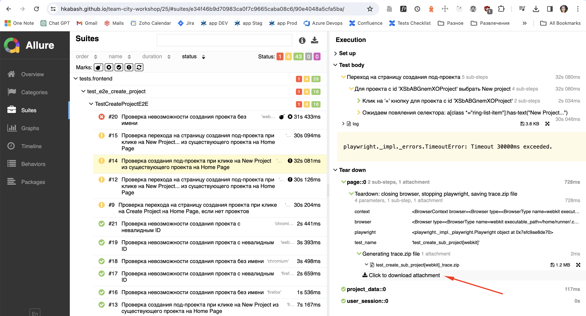

The **team-city-workshop** project is focused on the development of both API and UI automated test cases to validate various functionalities of **Team City.**

### Installation
Highly recommended to use virtual python environment to run tests.

To install the required libraries, download GitHub project and execute the following command in the root project's directory:

`pip install –r requirements.txt`

### Team City Server and Agent Setup using Docker
To set up Team City server and agent using Docker, follow the instructions provided [here](https://telegra.ph/15-API-test-konfig-i-specifikaciya-02-06). 
This guide will walk you through the steps to get your Team City server and agent up and running in Docker containers, 
making it easier to manage and isolate your CI/CD environment.

### Running Tests
Before running the tests, ensure you have obtained the **superadmin token**, which is necessary for authenticating API requests. 
The superadmin token can be found in the logs of the Team City server container.
Copy the superadmin token and paste it into .env file in the root directory.

#### Running with pytest
To run the tests execute the following command in the root project's directory:

`pytest tests/[test_file].py`

#### Running in parallel

For running tests in **parallel** you can use:

`pytest -n NUM tests/[test_file].py`,
where NUM is number of workers to run tests in parallel.

#### Running with Allure

#### Allure Installation

on Mac:

`brew install allure`

on  Windows:

firstly install Scoop if it is not installed yet:

`iwr -useb get.scoop.sh | iex`

Then install Allure with Scoop:

`scoop install allure`

To generate an Allure report run:

`pytest --alluredir=/path/to/results/directory tests/[test_file].py`

To view the report, use:

`allure serve /path/to/results/directory`

### Playwright configuration

For running frontend tests we use Playwright.
To install all needed browsers run in terminal:

`playwright install`

#### Playwright trace files

All frontend tests have `trace.zip` file that you can find in the `Teardown` of each test in `page` fixture:

To look into logs from trace.zip file:
1. Open https://trace.playwright.dev/
2. Move `trace.zip` file there

### CI/CD pipeline for GitHub Actions

Our project uses `GitHub Actions` to automate the execution of system tests, 
ensuring that each push or pull request to the **main** branch triggers a comprehensive check 
of the system's functionality.

For more details on each step, please refer to the workflow file located at [actions.yml](.github/workflows/actions.yml)

